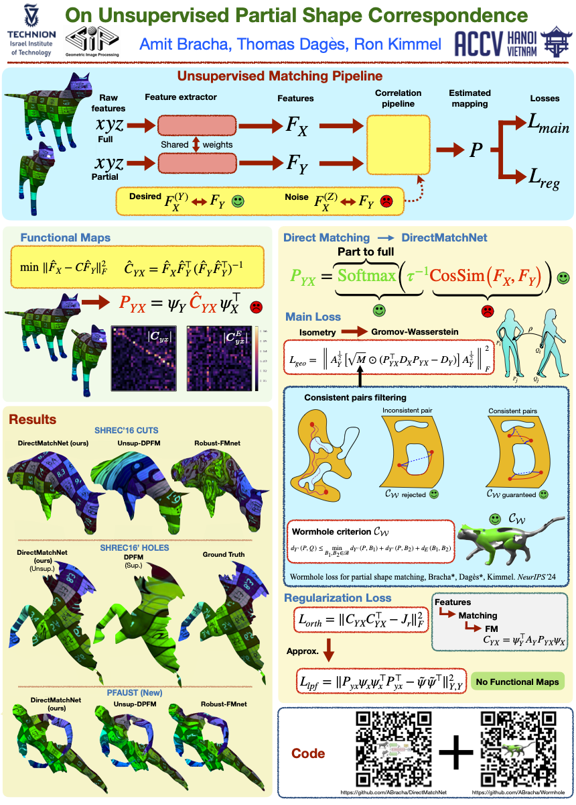

# DirectMatchNet: On Unsupervised Partial Shape Correspondence [\[Paper\]](https://openaccess.thecvf.com/content/ACCV2024/papers/Bracha_On_Unsupervised_Partial_Shape_Correspondence_ACCV_2024_paper.pdf)

---

## Abstract

While dealing with matching shapes to their parts, we often apply a tool known as functional maps. The idea is to translate the shape matching problem into “convenient” spaces by which matching is performed algebraically by solving a least squares problem. Here, we argue that such formulations, though popular in this field, introduce errors in the estimated match when partiality is invoked. Such errors are unavoidable even for advanced feature extraction networks, and they can be shown to escalate with increasing degrees of shape partiality, adversely affecting the learning capability of such systems. To circumvent these limitations, we propose a novel approach for partial shape matching. Our study of functional maps led us to a novel method that establishes direct correspondence between partial and full shapes through feature matching bypassing the need for functional map intermediate spaces. The Gromov Distance between metric spaces leads to the construction of the first part of our loss functions. For regularization we use two options: a term based on the area preserving property of the mapping, and a relaxed version that avoids the need to resort to functional maps. The proposed approach shows superior performance on the SHREC’16 dataset, outperforming existing unsupervised methods for partial shape matching. Notably, it achieves state-of-the-art results on the SHREC’16 HOLES benchmark, superior also compared to supervised methods. We demonstrate the benefits of the proposed unsupervised method when applied to a new dataset PFAUST for part-to-full shape correspondence.

## Code comming soon
In the meantime, you can explore the code we published for the Wormhole paper, which shares similarities with what we will release for DirectMatchNet. Check it out here - [link](https://github.com/ABracha/Wormhole).